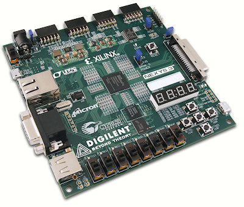

FPGA Connect4
===================
	UCLA CS 152A
	Spring 2015

	Alan Kha		904030522	akhahaha@gmail.com
	Alexander Wang	103889014	alexlw92@yahoo.com
-------------------------------------------------------------------------------
Overview
---------------
Connect4 game implemented on the Nexys3 Spartan-6 FPGA board.

Features
---------------
 - VGA display
 - Two-player turns
 - Reset enabled

Installation
---------------
1. Build and program with Xilinix ISE

Limitations
---------------
 - Broken debouncer (registers multiple signals per push)
